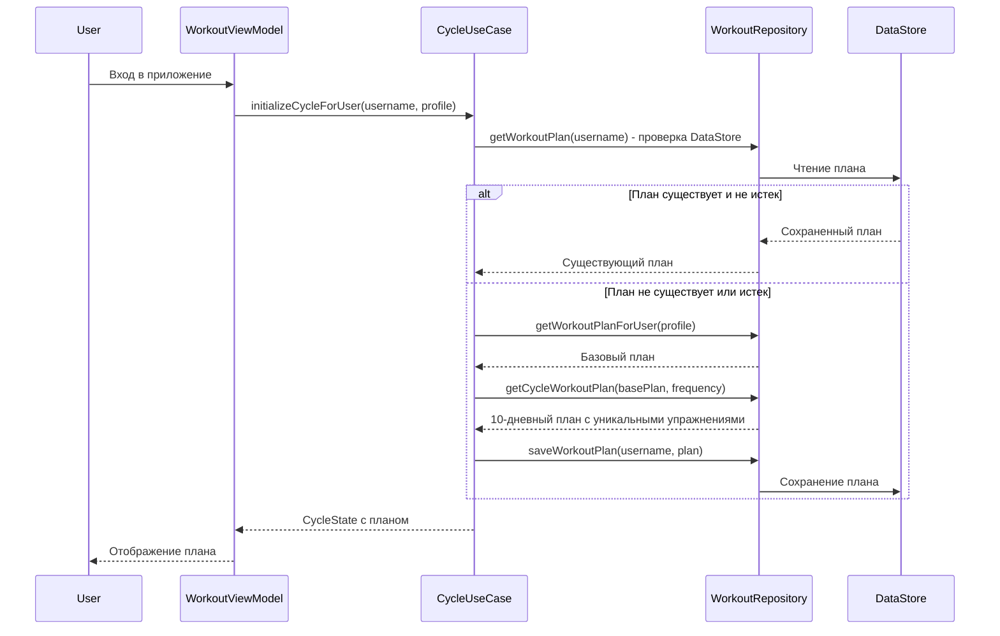

# User Story: Фиксация упражнений в плане тренировки

**As a** Пользователь приложения,
**I want** Чтобы упражнения в плане тренировки не менялись при повторном входе в тот же день,
**So that** Я могу видеть один и тот же набор упражнений на протяжении всего 10-дневного цикла, а упражнения не повторялись в разных днях.

### Priority
- [x] High (критично для пользовательского опыта)

### Actors
- [x] Зарегистрированный пользователь
- [x] System (автоматическое создание/перезагрузка плана)

### Context
**Текущая проблема:**
- При входе в экран тренировки план создается заново каждый раз
- Упражнения в дне меняются при каждом входе
- Упражнения могут повторяться в разных днях без контроля уникальности

**Ожидаемое поведение:**
- План создается один раз на 10 дней с уникальными упражнениями
- Упражнения в дне остаются неизменными при повторном входе
- Новый план создается только когда истекает дата последней тренировки

### Acceptance Criteria

**AC1: Создание и сохранение плана**
- **Given** Пользователь впервые заходит в приложение (или завершен предыдущий цикл)
- **When** Система инициализирует цикл тренировок для пользователя
- **Then** Создается новый 10-дневный план с уникальными упражнениями
- **And** План сохраняется в DataStore с ключом "{username}_workout_plan"
- **And** При последующих входах загружается сохраненный план (если 10 дней не истекли)

**AC2: Уникальность упражнений в 10-дневном плане**
- **Given** Создается 10-дневный план тренировки
- **When** Система формирует план с упражнениями
- **Then** Каждое упражнение встречается максимально уникально в рамках 10-дневного цикла
- **And** Повторение упражнений допускается только если в базе недостаточно уникальных упражнений для покрытия 10 дней
- **And** Повторы распределяются максимально равномерно по дням

**AC3: Сохранение упражнений при повторном входе**
- **Given** Пользователь создал план и вошел в "День 1" с набором упражнений [A, B, C, D]
- **When** Пользователь выходит из "День 1" и снова заходит в него
- **Then** Отображается тот же набор упражнений [A, B, C, D]
- **And** Порядок упражнений сохраняется
- **And** Все остальные параметры (подходы, повторения, вес) сохраняются

**AC4: Создание нового плана по истечении 10 дней**
- **Given** Пользователь имеет активный 10-дневный план с датой последней тренировки 2024-02-20
- **When** Наступает дата 2024-02-21 (следующий день после последней запланированной тренировки)
- **And** Пользователь заходит в приложение
- **Then** Создается новый 10-дневный план
- **And** Упражнения в новом плане могут отличаться от предыдущего
- **And** Старый план архивируется или удаляется

**AC5: Безопасность данных о прогрессе**
- **Given** Пользователь выполнил некоторые упражнения в 10-дневном плане
- **When** Система создает новый 10-дневный план
- **Then** Данные о прогрессе (выполненные упражнения, веса, повторы) сохраняются отдельно
- **And** Прогресс привязывается к дню упражнения с помощью ключа "{dayIndex}_{exerciseName}"
- **And** При отображении прогресс учитывается только текущий план

**AC6: Проверка условия нового плана по дате**
- **Given** Пользователь имеет активный план с 10 днями и датами тренировок
- **When** Текущая дата <= дате последней запланированной тренировки
- **Then** Используется существующий план из DataStore
- **When** Текущая дата > дате последней запланированной тренировки
- **Then** Создается новый план

### Non-Functional Requirements
- **Performance**: Загрузка плана из DataStore должна происходить < 500ms
- **Reliability**: План должен сохраняться немедленно после создания (перед любыми другими операциями)
- **Consistency**: Данные о плане должны быть согласованными между памятью и DataStore
- **Data Integrity**: При создании нового плана старый план должен быть безопасно заменен (race conditions prevention)

### Dependencies
- Зависит от: CycleUseCase (инициализация циклов), WorkoutRepository (создание/сохранение планов), WorkoutScheduleRepository (расписания тренировок)
- Блокируется: Нет

### Definition of Done
- [x] План сохраняется в DataStore после создания в CycleUseCase
- [x] При входе загружается сохраненный план (если цикл активен)
- [x] Реализована проверка условия создания нового плана по дате последней тренировки
- [x] Упражнения уникальны в рамках 10-дневного плана (повторы при необходимости)
- [x] Добавлены unit тесты для логики создания/загрузки плана
- [x] Добавлены интеграционные тесты для полной flows
- [x] Обновлена документация
- [x] Протестировано на реальном устройстве

---

## Use Case: Управление жизненным циклом плана тренировки

**ID**: UC-WKP-001
**Version**: 1.0
**Author**: Business Analyst
**Date**: 2024-02-16

### Overview
Сценарий описывает процесс создания, сохранения, загрузки и пересоздания плана тренировки для пользователя. План создается на 10 дней с уникальными упражнениями и пересоздается только по истечении срока действия.

### Primary Actor
Зарегистрированный пользователь приложения

### Preconditions
- [x] Пользователь зарегистрирован в приложении
- [x] Пользователь создал профиль (цель, уровень, частота тренировок)
- [x] В базе данных есть библиотека упражнений

### Main Flow (Happy Path)

| Step | Actor | System | Description |
|------|-------|--------|-------------|
| 1 | | | Проверяет наличие сохраненного плана в DataStore |
| 2 | | | Проверяет, истек ли срок действия текущего плана (текущая дата > даты последней тренировки) |
| 3 | | | Если план истек или не существует - создает новый 10-дневный план |
| 4 | | | Создает план с уникальными упражнениями для каждого дня |
| 5 | | | Сохраняет план в DataStore с ключом "{username}_workout_plan" |
| 6 | | | Генерирует расписание тренировок на 10 дней согласно выбранной частоте |
| 7 | | | Присваивает каждой тренировке дату из расписания |
| 8 | | | Отображает план пользователю |
| 9 | User | Открывает день тренировки | |
| 10 | | | Загружает упражнения для дня из сохраненного плана |
| 11 | User | Выходит из дня и снова заходит | |
| 12 | | | Отображает те же упражнения (план загружен из DataStore) |
| 13 | | | После завершения 10-го дня (по дате) при следующем входе создает новый план |

### Alternative Flows

**Alt Flow 1: Загрузка существующего плана**
- Предусловие: В DataStore существует активный план и срок действия не истек
- Действия:
  1. Система загружает план из DataStore
  2. Система проверяет, что текущая дата <= дате последней тренировки
  3. Система использует загруженный план без изменений
  4. Система отображает план пользователю

**Alt Flow 2: Недостаточно уникальных упражнений в базе**
- Предусловие: В библиотеке упражнений меньше 10 уникальных упражнений для определенной группы мышц
- Действия:
  1. Система распределяет доступные упражнения по дням по очереди
  2. После использования всех уникальных упражнений начинает повторять их с начала
  3. Повторы распределяются максимально равномерно (через равные интервалы дней)

**Alt Flow 3: Ошибка при загрузке плана**
- Предусловие: DataStore поврежден или план некорректен
- Действия:
  1. Система логирует ошибку
  2. Система создает новый план с нуля
  3. Система сохраняет новый план в DataStore
  4. Система продолжает работу с новым планом

**Alt Flow 4: Ручной сброс цикла**
- Предусловие: Пользователь вручную завершил текущий цикл (через UI или admin панель)
- Действия:
  1. Система устанавливает completedDate для текущего цикла
  2. Система очищает данные о выполнении упражнений
  3. Система создает новый план при следующем входе

### Postconditions
- [x] В DataStore сохранен актуальный план тренировки
- [x] Все даты тренировок валидны и соответствуют выбранной частоте
- [x] Упражнения уникальны в рамках плана (повторы при необходимости)

### Business Rules
- **BR1**: План создается ровно на 10 дней (Cycle.DAYS_IN_CYCLE)
- **BR2**: Упражнения должны быть максимально уникальными в рамках 10-дневного плана
- **BR3**: Повторы упражнений допускаются только при недостатке уникальных упражнений в базе
- **BR4**: План сохраняется в DataStore немедленно после создания
- **BR5**: Новый план создается только когда текущая дата > даты последней запланированной тренировки
- **BR6**: При сохранении плана используется ключ "{username}_workout_plan"
- **BR7**: Прогресс выполнения упражнений привязывается к плану через ключ "{dayIndex}_{exerciseName}"

### Error Conditions
- Ошибка DataStore: Создать новый план, логировать ошибку, продолжить работу
- Некорректный план в DataStore: Пересоздать план, логировать ошибку
- Нет библиотеки упражнений: Отобразить ошибку пользователю, прервать процесс

---

## Implementation Notes

### Текущая реализация
**Файлы для изменения:**

1. **CycleUseCase.kt** (строки 74-85)
   - **Проблема**: План создается каждый раз заново через `getWorkoutPlanForUser()` и `getCycleWorkoutPlan()`
   - **Решение**: Добавить проверку - если в DataStore есть план и срок действия не истек, загрузить его
   - **Сохранение**: Сохранять план в DataStore сразу после создания

2. **WorkoutRepositoryImpl.kt**
   - **createWeightLossPlanBySplit()** (строки 321-470): Улучшить логику уникальности упражнений
   - **createFullBodyDays()** (строки 858-885): Улучшить логику уникальности упражнений
   - **Методы создания планов**: Добавить параметр `excludedExerciseNames` для отслеживания использованных упражнений

3. **Проверка условия нового плана**
   - Добавить в CycleUseCase метод `isPlanExpired(username: String)`: Boolean
   - Проверять: `currentDate > lastScheduledDate`
   - Где `lastScheduledDate` - это `plan.days.last().scheduledDate`

### Алгоритм уникальности упражнений

**Текущая проблема в createWeightLossPlanBySplit():**
```kotlin
var legDayIndex = 0
var chestDayIndex = 0
// ...

for (dayIndex in 0 until 10) {
    val dayExercises = when (groupIndex) {
        0 -> getExercisesForDay(legExercises, legDayIndex, 4)
        // ...
    }
    when (groupIndex) {
        0 -> legDayIndex += 4  // Через 4 дня упражнения повторяются!
        // ...
    }
}
```

**Решение:**
- Создать пул доступных упражнений для каждой группы мышц
- Использовать `shuffled()` для перемешивания порядка (но без seed, чтобы сохранить детерминизм)
- Выбирать упражнения по очереди, пока пул не опустеет
- После опустошения пула, начать с начала (повторы)

### Псевдокод улучшенного алгоритма

```kotlin
private fun createDayExercises(
    exercisePool: List<Exercise>,
    usedExerciseIndices: MutableSet<Int>,
    exercisesPerDay: Int
): List<Exercise> {
    val selectedExercises = mutableListOf<Exercise>()
    var attempts = 0
    val maxAttempts = exercisePool.size * 2  // Ограничить попытки

    while (selectedExercises.size < exercisesPerDay && attempts < maxAttempts) {
        // Детерминированный выбор без рандомизации
        val index = (usedExerciseIndices.size) % exercisePool.size

        if (!usedExerciseIndices.contains(index)) {
            selectedExercises.add(exercisePool[index])
            usedExerciseIndices.add(index)
        }

        attempts++
    }

    return selectedExercises
}
```

### Sequence Diagram



### Тестовые сценарии

**TC1: Уникальность упражнений**
- Создать план на 10 дней
- Проверить, что упражнения максимально уникальны
- Проверить повторы при недостатке упражнений

**TC2: Сохранение плана**
- Создать план
- Сохранить в DataStore
- Загрузить из DataStore
- Проверить идентичность

**TC3: Проверка срока действия**
- Создать план с датами на 10 дней
- Попытаться загрузить до истечения срока → должен загрузиться сохраненный
- Попытаться загрузить после истечения срока → должен создаться новый

**TC4: Повторный вход в день**
- Создать план
- Войти в День 1
- Выйти и войти снова
- Проверить, что упражнения те же

### Database/Storage Schema Changes

**DataStore Keys:**
- Существующий: `{username}_workout_plan` - JSON сериализованный WorkoutPlan

**Дополнительные поля (если нужны):**
- Нет изменений в схеме, используем существующий DataStore

### Risk Analysis

| Risk | Probability | Impact | Mitigation |
|------|-------------|--------|------------|
| Race condition при сохранении плана | Medium | High | Добавить транзакционную операцию в DataStore |
| Нехватка уникальных упражнений в базе | High | Low | Равномерное распределение повторов |
| Коррупция данных в DataStore | Low | Medium | Обработка ошибок, создание нового плана |
| Сложность миграции существующих пользователей | Medium | Medium | Автоматическое создание нового плана при первом входе |

---

## Open Questions / Clarifications

1. **Seed для рандомизации**: Не нужен (оставить текущий детерминированный порядок)
2. **Пересоздание плана**: Только по дате последней тренировки
3. **Уникальность**: Полная уникальность, повторы при необходимости
4. **Сохранение прогресса**: Прогресс сохраняется отдельно через ExerciseCompletionRepository

---

**Version History:**
- v1.0 (2024-02-16): Initial requirements document
